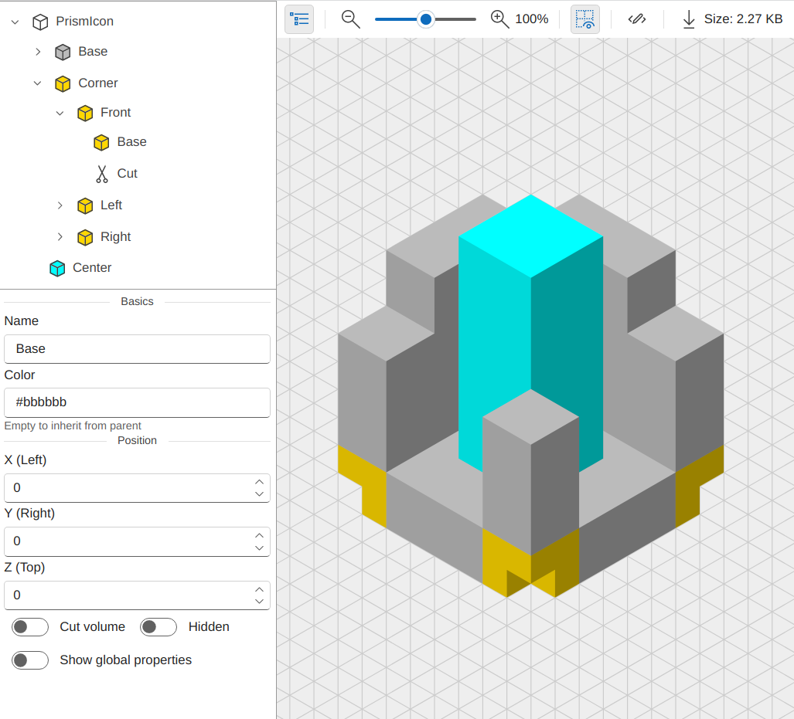

#  Prism
Prism Hex Grid Drawing Tool. https://prism.pistonite.org

This is an app that renders prisms to a hex grid. I like to think of it as a stripped-down version of blender.

You can export the design to an SVG file.

